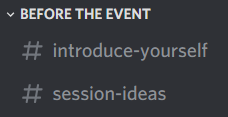
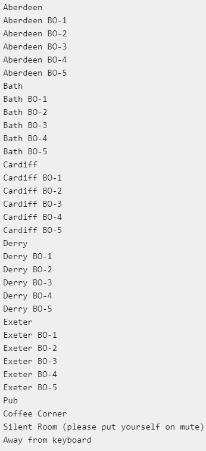
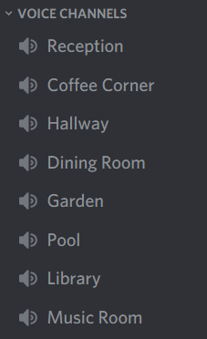
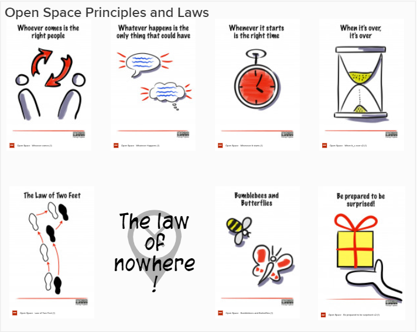
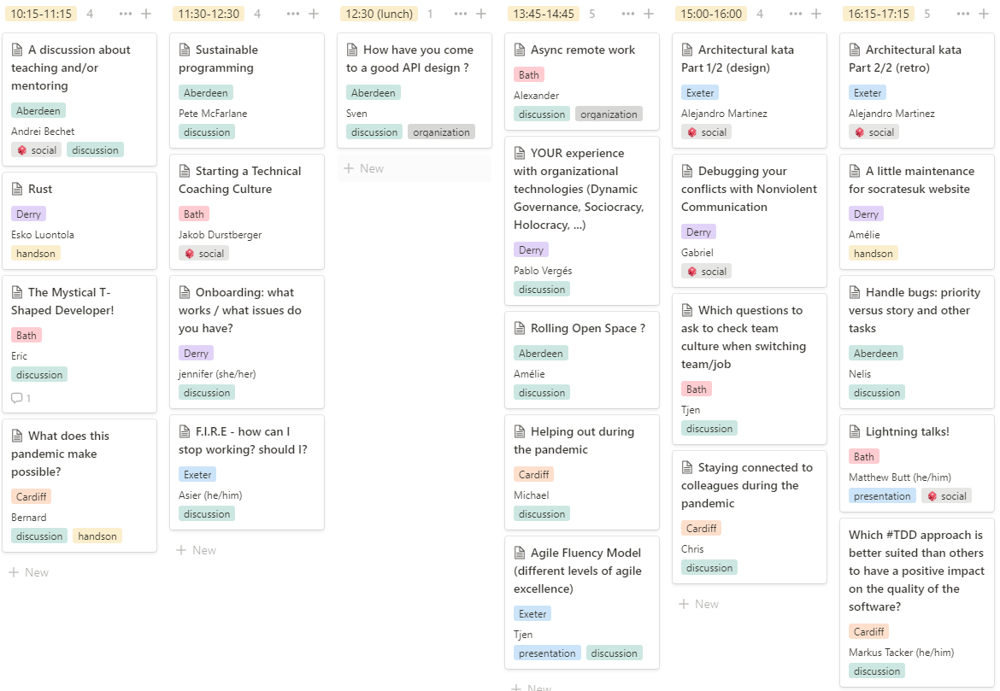



## Digital Autumn 2020

We ran a third digital open space for SoCraTes UK, on 20th November 2020 :)

## How did it go?

We held a digital open space for SoCraTes UK 2020, as a 1-day event. This explains the tools & techniques we used, and what worked well / could be even better. We hope this helps others organise their own events and are keen to hear about your own experiences.

To go straight to what the day was like for participants, see the [On The Day](#on-the-day) summary.

## Warm Up

### 1 month+ before the event

We did some 'Save The Date' communications. For us, that looked like:
- a [tweet](https://twitter.com/SoCraTes_UK/status/1315720861735845889)
- a message on our [crafters slack channel](https://softwarecrafters.slack.com/archives/C0HUL75R6/p1602527588001800)
- a message on the discord channel used in the last edition

### A few weeks before the event

We met to decide whether to use the same tools as last time, and thought they worked great so kept everything the same.

We continued to manage the tickets via [eventbrite](https://www.eventbrite.co.uk/e/socrates-uk-2020-digital-autumn-tickets-124810691137). We charged a small fee to cover the cost of Zoom accounts and reduce the drop-out rate.

We added a synopsis of the event on our [website](https://github.com/SoCraTesUK/socrates-uk/blob/032810c854addc55433c663a4b77b45308b5c149/digital-2020-autumn.md).

### A week before the event
(this would have ideally been done a few weeks before the event, but .... 2020 ¯\_(ツ)_/¯)

We sorted our priority tickets.

We got in touch with folks on our mailing list to let them know about the event.

### A few days before the event
(ideally a week-ish before)

We sent an invitation to join our discord server to all people who had bought a ticket (via Eventbrite).

We invited people to say a bit about themselves on a dedicated #introduce-yourself discord channel. 

We created a #session-ideas discord channel. This again got some traffic the day before the conf, and on the day itself. Folks got some feedback about their session ideas.

We copied the notion workspace from the last event and made the necessary revisions. This included generating a mural board for each of the rooms, with areas on it for each of the sessions. These are great to encourage people to add visualisation to their session.

### Days before the event

We created various rooms. We kept our theme of towns in the 4 nations[^1] of the UK: **A**berdeen, **B**ath, **C**ardiff, **D**erry, **E**xeter and ...the Pub. We created them in 2 places:
*   in zoom
*   on the notion workspace, as labels for people to add in their session

The zoom call was organised as follows:
- plenary session in the main room
- flat list of breakout rooms for:
  - each session room: _Aberdeen_, _Bath_, _Cardiff_ etc
  - 5 additional rooms for each session room, in case folks wanted to break off into smaller groups: _Aberdeen BO-1_, _Aberdeen BO-2_, etc
  - generic hang-out rooms for people who wanted to be in the space without being in sessions: _Garden_, _Pub_, _Coffee Corner_, _Silent Room_, _Away from keyboard_

At that point, these was not shared with the participants.

We also kept 2 of the voice channels in discord (which also have limited video support). These were named after popular places in our existing venue: Garden, Entry Hall.

## On the day

We worked with:
- the discord channels
- a single zoom call with all the breakout rooms
- the [notion workspace](https://www.notion.so/SoCraTes-2020-Autumn-Edition-7a2b1769d42147bca5abbf38a5a8c7a6)

We opened the zoom call (& all the rooms) at 8.30am (uk time - see this [timezone friendly schedule](https://bit.ly/socratesuk-2020-autumn) for other times).

As people started arriving, we'd chat with them in the main zoom room. Some folks then wandered around the rest of the rooms: the coffee corner was for example quite popular.

### Opening Circle

It was [Juke](https://twitter.com/Singsalad) who facilitated the event 🤩

They helped **break the ice** first by pairing people into separate rooms, so folks could chat about what they expected for the day and any session they might run. We ran into some technical difficulties (it turns out the version of the zoom client of the Host is important) and folks we super helpful/patient as we worked out why the breakout rooms did not function as planned, and closed/re-opened them.

We got on our way with the introductions

WIP - what else did we do for our ice-breakers?

We then had an intro to the rules of open space, with an extra _Law of Nowhere_, to make it explicit it is ok to not be in any of the digital places for a while.

Pictures by Pierluigi Pugliese

We also shared a summary from the feedback to session hosts & attendees from previous events, as a way to keep the community learning.

The queueing for putting sessions onto the **marketplace** was done by adding sessions to notion without any timing on it, so they appeared in the left column of the schedule. People then gave an introduction to their session and selected a particular room via a label, at a particular time.

### Sessions

They happened in the single day-long running zoom call, with the different breakout rooms. Folks chose different media to collaborate / record the outcome (dedicated mural boards, google docs, etc)

The generic zoom rooms were great places to just hang out.

From an organiser point of view, we rotated who was Host (as in Zoom Host) throughout the day, as in this role you have to keep an eye on the main room for people who might drop off the call: the ability to move themselves to the breakout rooms doesn't work for some folks (depending on the version of the zoom client and the type of device), so a few need help moving to where they'd like to be.

### Closing Circle

We brought everyone back together and asked WIP (how did we close this time?)

We also had a separate retro board on mural, where we asked people (they filled these in groups of 3 or 4):
*   What feedback would you like to give to other attendees?
*   What feedback would you like to give to session hosts?
*   What feedback would you like to give to the organisers and facilitators?

WIP share the actual board/a screenshot?

### Evening activities

This time there were some folks who were still going in the evening, and we had:
* Folks catching up with each other
* [Playing board games](https://www.notion.so/Play-a-digital-board-game-1830-GMT-1930-CET-93eb9e07fb8e4685a686eec0c9a27408#ede9c17ccbae4fa2a28ae87fad059612): we tried _Pandemic: Hot Zone_ (!) via tabletopia.com
* Some rounds of improv' 😂

## Afterthoughts

### what we/folks loved

WIP find some examples from the feedback board

### tweaks for next time

* Set ourselves some reminders to do the preparation in good times
* Manage both kinds of tickets (free / paid for) via eventbrite, and let people choose which one they want. This way we don't have to manage 2 lists and do separate comms
* Reach out to other communities ahead of time (ladies of code, codebar etc)
* Prepare & share the notion workspace earlier, so people can check access / editing (include a 'how to' video so people can practice adding a session, to run more smoothly on the day)