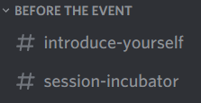



# Digital Spring 2020

8th May 2020

## How did it go?

We held a digital open space for SoCraTes UK 2020, as a 1-day event. This explains the tools & techniques we used, and what worked well / could be even better. We hope this helps others organise their own events and are keen to hear about your own experiences.

## Warm Up

### A few weeks before the event

We created the tickets via [eventbrite](https://www.eventbrite.co.uk/e/socrates-uk-2020-digital-spring-tickets-101979310864#), mostly because that is the platform where we normally have tickets. We charged a small fee to cover the cost of Zoom accounts and reduce the drop-out rate.

We added a synopsis of the event on our [wiki page](https://github.com/SoCraTesUK/socrates-uk/wiki/Digital-SoCraTes-UK-2020).

We created a discord server.

### A week(ish) before the event

We sent an invitation to join our discord server to all people who had bought a ticket (via Eventbrite).

We ran a workshop on "how to host a session in a remote open space", to help people start thinking about the specificity of virtual sessions ([recording](https://us02web.zoom.us/rec/share/_fFxNrf6pkJJHaP3-gb4YIAYJ5jeX6a8hiNMq6AEzkzmonqQRcyX-VUt51dh1Hkt)). We also used the same tools as we’d use during the event so people started becoming more familiar with them.

We invited people to say a bit about themselves on a dedicated #introduce-yourself discord channel. This worked really well: folks shared their background and reacted to each other’s intros.

We created a #session-incubation discord channel. This got some traffic the day before the conf, and on the day itself. Folks got some feedback about their session ideas.

### Days before the event

We created various rooms. We had 6, aptly named after towns in the 4 nations[^1] of the UK: **A**berdeen, **B**ath, **C**ardiff, **D**erry, **E**xeter and ...the Pub. We created them in 2 places:
*   in zoom
*   on the mural board (with a link to the zoom room)

At that point, this was not shared with the participants.

We also created some voice channels in discord (which also have limited video support). These were named after popular places in our existing venue: Reception, Coffee Corner, Hallway, Dining Room, Garden, Pool, Library, Music Room.

## On the day

We had a mural board with an _Arrival Hall_ for welcoming people in. Folks created their avatar as they arrived.

We also had a _Venue_ section representing the different rooms, as well as a generic Discord location so folks could move their avatar to show where they were.

This gave an indication of how sessions were attended (the equivalent of peeking into a room / walking around the conference rooms).

### Opening Circle

It was [Juke](https://twitter.com/Singsalad) who facilitated the event 😍

They helped **break the ice** first by pairing people into separate rooms, so folks could chat about what they expected for the day and any session they might run. We brought people back together and Juke then had a great invitation: sharing a picture that represents the UK for you. They gave the instructions first, then allowed for a couple of mins so people had time to find a suitable picture, then asked people to post them simultaneously in a dedicated #picture-challenge discord channel.

It was a blast and people got very creative :)

We then had an intro to the rules of open space, with an extra _Law of Nowhere_, to make it explicit it is ok to not be in any of the digital places for a while.

Pictures by Pierluigi Pugliese

The queueing for putting sessions onto the **marketplace **was done by dragging digital post-its by the side of the schedule itself on the mural board, as we would have queued physically. People then gave an introduction to their session and added them into a particular room, at a particular time.

We had the usual hussle and sessions moving to jiggle things into place as session hosts made adjustments and people expressed their preferences.

### Sessions

They happened in the day-long running zoom rooms. Folks chose different media to collaborate / record the outcome (dedicated mural boards, google docs, etc)

The discord voice rooms were great places to just hang out. We had some video sharing over lunchtime :)

### Closing Circle

We brought everyone back together and asked to share a picture, this time of how they felt at the end of this special day.

We also had a separate retro board on mural, where we asked people (they filled these in groups of 3 or 4):
*   What did you learn?
*   What surprised you?
*   What will you do differently when you go back to work?[^2]
*   What feedback would you like to give to other attendees?
*   What feedback would you like to give to session hosts?
*   What feedback would you like to give to the organisers and facilitators?

We also had sliding scales for practical details:

*   The amount of timeslots (4) was: Not enough &lt;-> Too many

    (majority ‘just right’ leaning to Not enough)
*   The length and amount of breaks was: Not enough &lt;-> Too much

    majority ‘just right’ leaning to ‘Too much’)

*   The size of the event (50 people) was: Too small &lt;-> Too big

    (majority was ‘just right’, ever so slightly Too small)
*   This event should happen again: Never &lt;-> In 1 month or sooner

    (majority was ‘in a few months’ with some ‘in 1 month or sooner’)

For this, we had prepared lots of icons of varying emotions, so people could quickly drag/drop them or copy them.

## Cool down

We had a #stay-in-touch discord channel where people could drop their contact details. Most folks did this at the end of the day, and mostly twitter handles.

## What we learnt

It felt like a SoCraTes ✨(See what [folks said](https://twitter.com/search?q=(%23socratesuk) until%3A2020-05-10 since%3A2020-05-07&src=typed_query&f=live)). The number of active people fluctuated during the day (similar to in-person events, in a way!) and we were roughly the same amount of people at the opening / closing 🎊. We sold 80 tickets and had about 50 people joining the shared sessions at a time.

The crowd were awesome 😍

Having people in pairs at the beginning was a little too intimate for some and if one person had technical difficulty joining the room, someone would be left hanging -> we’d probably do groups of 3 or 4 next time. 👥👤

There were some confusions about which channel to use for what on discord. It might be good to have a plan beforehand and communicate that at the start. 🔀

Some folks missed out the voice channels completely, so maybe a tour of discord would have helped? 🔊

Having a continuous #feedback channel was amazing, we tweaked a lot of things as we went along to make it nicer for everyone. 👂

Mural struggled when all 50 people were in the same area and broadcasting their position. Switching off broadcasting helped a lot. We also provided alternatives by sharing one screen and asking people to drop out as soon as they had added their session. And we had a channel to support people by announcing a session for them.

If you were at the event  and have something to share , please reach out via discord, [twitter](https://twitter.com/SoCraTes_UK) or [slack](https://softwarecrafters.slack.com/archives/C0HUL75R6)[^3]. Or if you have things to say in general, we’re [listening](https://socratesuk.org/contact.html).

----
<!-- Footnotes themselves at the bottom. -->
_Notes_

[^1]:
     In alphabetical order of the town they appear in: Scotland, England, Wales and Northern Ireland

[^2]:

     We later realised we can make that more inclusive (some people who attended were unemployed) by asking: _What is something you can take away and apply in your day to day life?_

[^3]:
     Join the software [crafters slack](http://slack.softwarecrafters.org)

