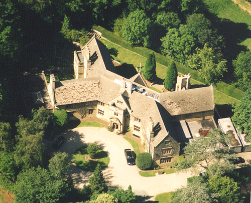
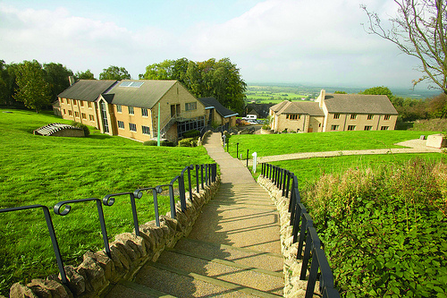

### What is SoCraTes?

A retreat for open-minded craftspeople who strive to improve their craft and the software industry as a whole.

The gathering will happen from the evening of **Thursday 12th June** until the evening of **Saturday 14th**. On **Sunday 15th**, weather allowing, we will have a nice long walk around the beautiful English countryside or we will have a code retreat.

Registration will open soon.

<!--
Register using the form below, or [head over to Eventbrite][Eventbrite].

    <iframe src="http://www.eventbrite.co.uk/tickets-external?eid=6777522753&amp;ref=etckt&amp;v=2" frameborder="0" height="260" width="100%" vspace="0" hspace="0" marginheight="5" marginwidth="5" scrolling="auto" allowtransparency="true">&nbsp;</iframe>
    
<a style="color:#ddd; text-decoration:none;" target="_blank" href="http://www.eventbrite.co.uk/r/etckt">Sell Tickets Online</a> through <a style="color:#ddd; text-decoration:none;" target="_blank" href="http://www.eventbrite.co.uk?ref=etckt">Eventbrite</a>

-->

 

[Eventbrite]: http://socratesuk.eventbrite.co.uk?ref=elink

### What can you expect?

Set as a self-organized open space over two days, expect highly interesting discussions and practical sessions with extremelly passionated and talented software craftsmen like you.

As we are all staying in the same beautiful countryside hotel, besides all the great technical content during the day, expect to have some fun and drinks until late in the evening. Don't be surprised to see people banging on guitars and other instruments, playing games and, of course, having some drinks in the garden. Just join the fun.

### Where is it taking place?

The retreat will be hosted at [Farncombe (Cotswold Conference Centre)][Venue], a 300+ acre conference and hotel estate in the [Cotswolds][], one of the most beautiful places in the English countryside.

All attendees are expected to stay in the hotel for at least three days and two nights, with the option of staying for an extra day and night. We can only accept as many people as there are rooms available.

<iframe width="560" height="315" src="http://www.youtube.com/embed/IyfXSIaK-rU" frameborder="0" allowfullscreen="allowfullscreen">&nbsp;</iframe>

More information regarding accommodation can be found on the [Details page][Details].

[Venue]: http://cotswoldconferencecentre.com/venue/
[Cotswolds]: http://www.cotswolds.info/
[Details]: details.html

### Who should attend?

Anyone who is passionate about software, aware or involved in Software Craftsmanship, and who wants to share their knowledge, experience, expertise, but is also willing and keen to learn from others.

### Who's organizing?

SoCraTes UK is organized by the people behind the [London Software Craftsmanship Community][]—for developers, by developers.

[London Software Craftsmanship Community]: http://londonswcraft.com

### Sounds great! Count me in?

<!--
Registrations are open on [Eventbrite][Eventbrite]. To keep up to date with news, [follow us on twitter][@socrates_uk].
-->
Registration will be open on the 10th of January.

### Inspiration

SoCraTes UK was inspired by [SoCraTes Germany][], our favourite Software Craftsmanship conference.

[SoCraTes Germany]: http://www.socrates-conference.de/

[@socrates_uk]: https://twitter.com/socrates_uk
