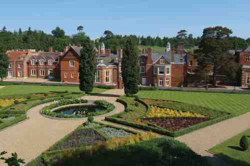
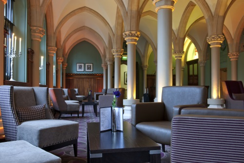
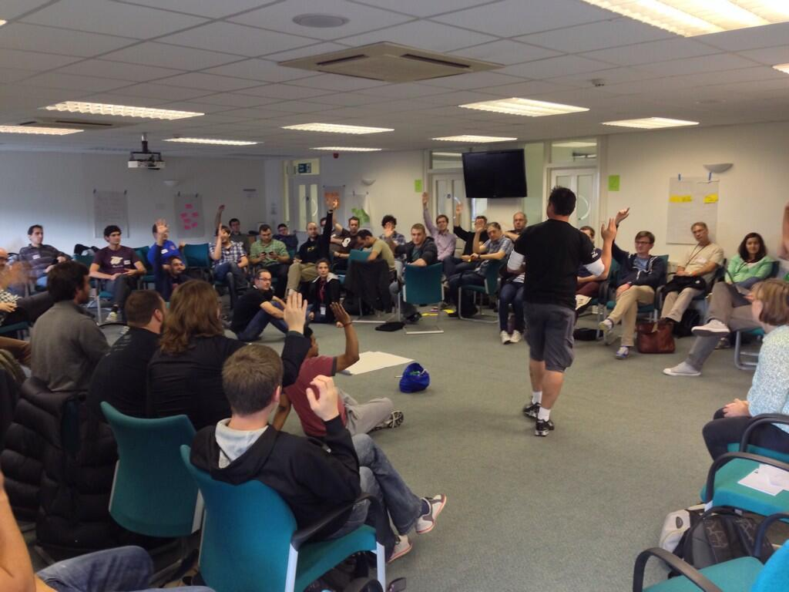
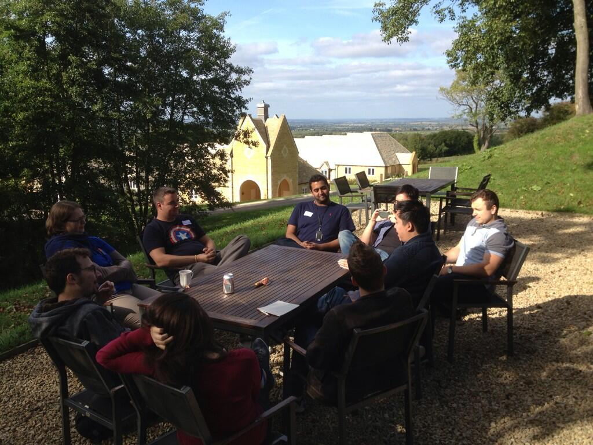
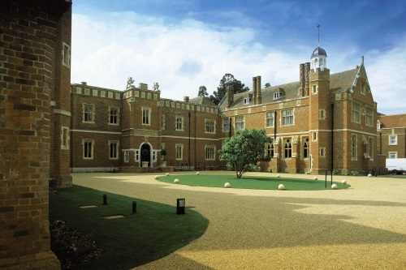
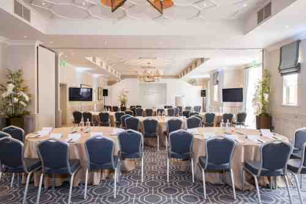
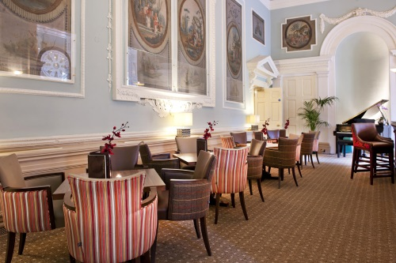
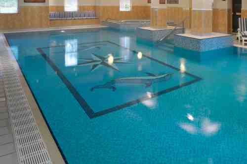

### What is SoCraTes?

SoCraTes UK is a non-profit, **international Software Craftsmanship retreat** for open-minded craftspeople who want to improve their craft and the software industry as a whole. Organised by [Codurance][Codurance] and the [London Software Craftsmanship Community][LSCC] (LSCC), the conference attracts Software Craftsmanship thought leaders and software craftspeople from all over the world.

Like its [counterpart in Germany][SoCraTes Germany], SoCraTes UK is totally community-focused. It's a great opportunity to speak to and code with many like-minded and talented developers in a very relaxed and beautiful [hotel Wotton House, Surrey][WottonHouse]. **The conference itself is free.** The only thing you pay for is the hotel, including meals.

 

### Registration and Price Information

We will be charging a __NON-REFUNDABLE__ deposit for each ticket. The remaining amount will be paid directly to the hotel when you checkout. 

* 3 nights - Single room: £250.00 deposit + £175.00 (paid on checkout). Total £425 + Eventbrite Fee
* 3 nights - Shared Twin room: £250.00 deposit + £140.00 (paid on checkout). Total £390 + Eventbrite Fee

All tickets include breakfast, lunch and dinner. Drinks are NOT included.
Tea, coffee and biscuits will be served for free throughout the day. 

<iframe style="margin-top:20px;" src="//eventbrite.co.uk/tickets-external?eid=19754356813&ref=etckt" frameborder="0" height="370" width="100%" vspace="0" hspace="0" marginheight="0" marginwidth="5" scrolling="auto" allowtransparency="true"></iframe>

__Twin Room__: Buying a ticket for a twin room means that you are reserving __one__ bed in a twin room. If you want to make sure that you and a friend can share the same room, we recommend you buy the two tickets together. If you'd like to share a room with someone you already know, don't worry:  [go to the our wiki][wiki] and register your preference.

__NOTE: In the event you do not show up for the conference, you will still be liable to pay the remaining amount of the ticket to the hotel—you will have a room reserved in your name.__

[wiki]: https://github.com/lscc/socrates-uk/wiki

 

### What happens at SoCraTes?

The gathering runs from **Thursday 2nd June** to **Sunday 5th June, 2016**.

We'll kick off Thursday evening with introductions, then we'll run a **group discussion**, talking about an issue relevant to all of us. After that, we'll have dinner together to continue the conversation, twist it around and branch it in every direction.

On Friday and Saturday, we'll run an **open space**, in which every attendee is welcome and encouraged to propose talks, discussions, workshops or whatever else they choose to further every attendee's knowledge and understanding of creating and maintaining software.

On Friday and Saturday evenings, attendees are encouraged to run social activities, from pair-programming to board games and everything in between.

On **Sunday 5th**, weather allowing, we will have a nice long walk around the beautiful English countryside, or a code retreat, followed by lunch and informal activities up and until people head home.

	

		

			
		

		

			
		

	

	

		

			
		

		

			
		

	

### Why should I attend?

SoCraTes UK is designed to encourage the participation of all attendees via coding activities, group discussions, presentations, informal conversations, and whatever else the participants decide to do.

SoCraTes UK is run in an **unconference** style. Organised sessions start at 9am and finish at 6pm. However, since this is an unconference, attendees are free to carry on until whenever they like, and run or attend whichever sessions they choose. Expect **workshops**, **talks**, **group discussions** and **demonstrations** from morning 'til night.

As it's an unconference, it's *you* and people like you who will be organising the sessions. You won't just learn, you'll also teach. Anyone who is passionate about software, aware or involved in Software Craftsmanship, and who wants to share their knowledge, experience, expertise, but is also willing and keen to learn from others, should come.

Besides talking about software and writing code, we also have evening events (organised by the participants), ranging from pair-programming sessions and workshops to more **social events**, such as gaming, music and drinks. Bring along your guitars and saxophones, your board games and packs of cards, and bone up on the rules to Werewolf. And expect to have philosophical discussions on craftsmanship as you play.

Since we are all in the same hotel, we have a lot of time to spend together. Conversations and coding activities can go for **as long as you want**. Sessions will take place in proper rooms with projectors, tables, and chairs, but also wherever people congregate—last year, people spent a lot of time outside in the garden, enjoying the weather and the beautiful landscape as they discussed the intricacies of software development.

If the English weather allows it, we will spend some time on Sunday morning walking along the beautiful English countryside, discussing what we've learnt, reflecting on the past few days and relaxing before heading back to the real world.

SoCraTes UK is a **true Software Craftsmanship gathering**. Don't miss out.

 

### Where is it taking place?

The retreat will be hosted at [Wotton House][WottonHouse], which is surrounded by 13 acres of beautifully landscaped grounds, delivering tranquil setting and backdrop for SoCraTes UK 2016. 

[Wotton House][WottonHouse] is just 10 minutes from junction 9 of the M25, 20 minutes from Guildford, 30 minutes from Gatwick Airport and just 40 minutes by train into London’s Waterloo. [Wotton House][WottonHouse] is easily accessible by air, rail or car. It’s situated on the A25 between Guildford and Dorking, within easy reach of London and the main motorways.

The nearest train station is Dorking, 4 miles away.

Please check [Wotton House Google Maps location][WottonGoogleMaps] to ensure you get to the hotel correctly.

Free parking is available.

More information regarding accommodation can be found on the [Details page][Details].

	

		

			
		

		

			
		

	

	

		

			
		

		

			
		

	

[LSCC]: http://www.meetup.com/london-software-craftsmanship/
[WottonHouse]: http://www.wottonhousedorkingsurrey.co.uk/
[WottonGoogleMaps]: https://www.google.co.uk/maps/place/Wotton+House/@51.210842,-0.3960782,135m/data=!3m1!1e3!4m7!1m4!3m3!1s0x0:0x0!2zNTHCsDEyJzM5LjIiTiAwwrAyMyc0NC42Ilc!3b1!3m1!1s0x0000000000000000:0x9b7aa884271af6b5!6m1!1e1?hl=en
[Details]: details.html

### Who are the organisers?

SoCraTes UK is organised by [Codurance][Codurance] and the people behind the [London Software Craftsmanship Community][LSCC].

[Codurance]: http://www.codurance.com
[LSCC]: http://www.meetup.com/london-software-craftsmanship/

 

### Conference Code of Conduct

SoCraTes UK follows the [Conference Code of Conduct][] laid out by several conference organisers around the globe. We ask that you read [the full version][Conference Code of Conduct] before attending. You are required to cooperate with the code throughout the event to help ensure a safe environment for everybody.

#### The Quick Version

	 Our conference is dedicated to providing a harassment-free conference experience for everyone, regardless of gender, age, sexual orientation, disability, physical appearance, body size, race, or religion. We do not tolerate harassment of conference participants in any form. Sexual language and imagery is not appropriate for any conference venue, including talks, workshops, parties, Twitter and other online media. Conference participants violating these rules may be sanctioned or expelled from the conference <strong>without a refund</strong> at the discretion of the conference organisers.

 

### Inspiration

SoCraTes UK was inspired by [SoCraTes Germany][], our favourite Software Craftsmanship conference.

 

### All Partner Conferences

* [CodeFreeze][] / 11 - 12 Jan 2016, Kiilopää, Finland
* [SoCraTes Canaries][] / 10 - 13 Mar 2016, Gran Canaria, Spain
* [SoCraTes Italy][] /  12 - 14 May 2016, Rimini, Italy
* [SoCraTes Day Switzerland][] / 17 May 2016, Zürich, Switzerland
* [I T.A.K.E. Unconference][] / 19 - 20 May 2016, Bucharest, Romania
* [SoCraTes Germany][] / 25 - 28 Aug 2016, Soltau, Germany
* [SoCraTes France][] 
* [SoCraTes BE][]

  <a href="/sponsorship.html" class="btn btn-primary btn-lg">Become a sponsor</i></a>

[@socrates_uk]: https://twitter.com/socrates_uk
[SoCraTes Germany]: http://www.socrates-conference.de/
[Farncombe Gallery]: http://farncombeconferencecentre.com/venue/gallery/
[Conference Code of Conduct]: http://confcodeofconduct.com/
[CodeFreeze]: http://www.codefreeze.fi/
[SoCraTes Canaries]: http://www.socrates-conference.es/doku.php
[I T.A.K.E. Unconference]: http://itakeunconf.com/
[SoCraTes Day Switzerland]: http://socrates-day.ch/
[SoCraTes France]: http://socrates-fr.github.io/
[SoCraTes BE]: http://socratesbe.org/
[SoCraTes Italy]: http://socrates-it.github.io/
