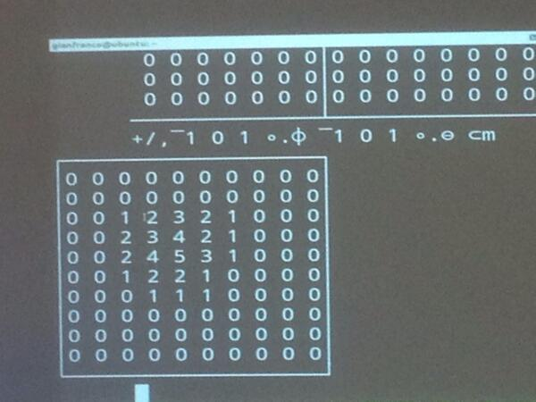
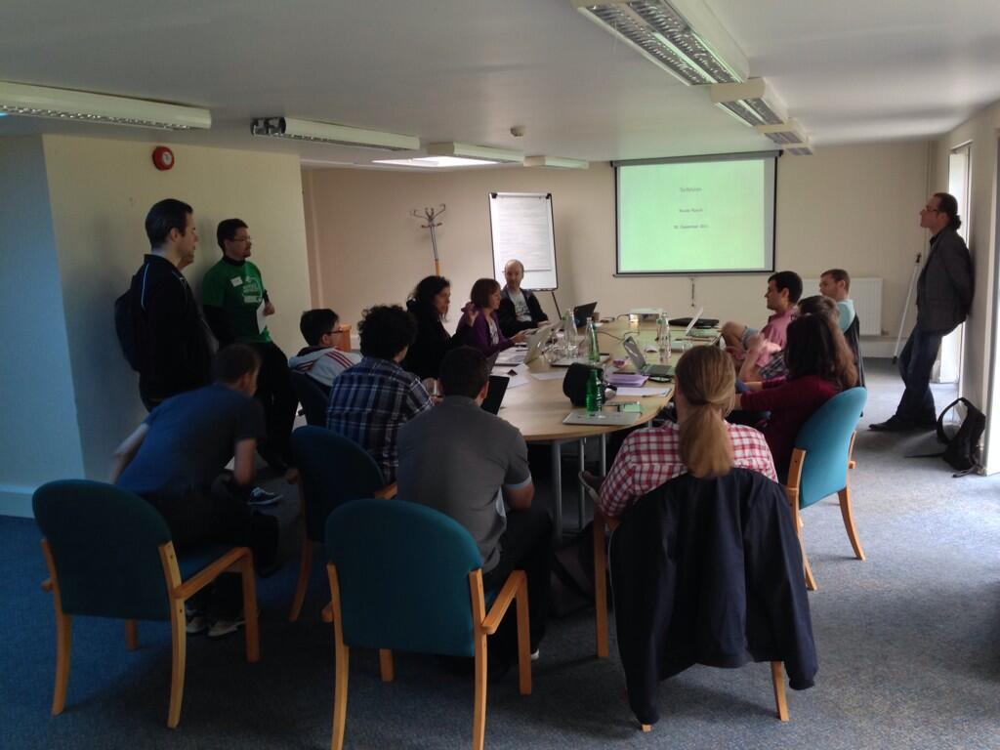
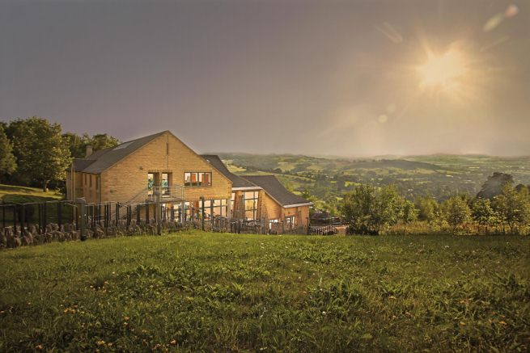
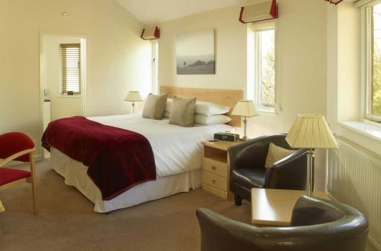
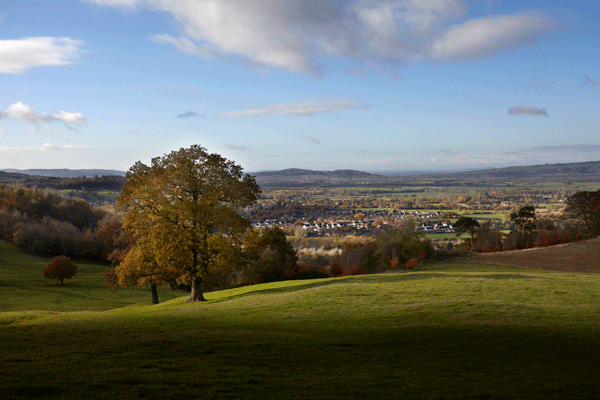

### What is SoCraTes?

SoCraTes UK is a non-profit, **international Software Craftsmanship retreat** for open-minded craftspeople who want to improve their craft and the software industry as a whole. Organised by the [London Software Craftsmanship Community][LSCC] (LSCC), the conference attracts Software Craftsmanship thought leaders and software craftspeople from all over the world.

Like its [counterpart in Germany][SoCraTes Germany], SoCraTes UK is totally community-focused. It's a great opportunity to speak to and code with many like-minded and talented developers in a very relaxed and beautiful [countryside hotel in the Cotswolds][Farncombe Gallery]. **The conference itself is free.** The only thing you pay for is the hotel, including meals.

 

### What happens at SoCraTes?

The gathering runs from **Thursday 4th June** to **Sunday 7th June, 2015**.

We'll kick off Thursday evening with introductions, then we'll run a **group discussion**, talking about an issue relevant to all of us. After that, we'll have dinner together to continue the conversation, twist it around and branch it in every direction.

On Friday and Saturday, we'll run an **open space**, in which every attendee is welcome and encouraged to propose talks, discussions, workshops or whatever else they choose to further every attendee's knowledge and understanding of creating and maintaining software.

On Friday and Saturday evenings, attendees are encouraged to run social activities, from pair-programming to board games and everything in between.

On **Sunday 7th**, weather allowing, we will have a nice long walk around the beautiful English countryside, or a code retreat, followed by lunch and informal activities up and until people head home.

	

		

			
		

		

			
		

	

	

		

			
		

		

			
		

	

### Why should I attend?

SoCraTes UK is designed to encourage the participation of all attendees via coding activities, group discussions, presentations, informal conversations, and whatever else the participants decide to do.

SoCraTes UK is run in an **unconference** style. Organised sessions start at 9am and finish at 6pm. However, since this is an unconference, attendees are free to carry on until whenever they like, and run or attend whichever sessions they choose. Expect **workshops**, **talks**, **group discussions** and **demonstrations** from morning 'til night.

As it's an unconference, it's *you* and people like you who will be organising the sessions. You won't just learn, you'll also teach. Anyone who is passionate about software, aware or involved in Software Craftsmanship, and who wants to share their knowledge, experience, expertise, but is also willing and keen to learn from others, should come.

Besides talking about software and writing code, we also have evening events (organised by the participants), ranging from pair-programming sessions and workshops to more **social events**, such as gaming, music and drinks. Bring along your guitars and saxophones, your board games and packs of cards, and bone up on the rules to Werewolf. And expect to have philosophical discussions on craftsmanship as you play.

Since we are all in the same hotel, we have a lot of time to spend together. Conversations and coding activities can go for **as long as you want**. Sessions will take place in proper rooms with projectors, tables, and chairs, but also wherever people congregate—last year, people spent a lot of time outside in the garden, enjoying the weather and the beautiful landscape as they discussed the intricacies of software development.

If the English weather allows it, we will spend some time on Sunday morning walking along the beautiful English countryside, discussing what we've learnt, reflecting on the past few days and relaxing before heading back to the real world.

SoCraTes UK is a **true Software Craftsmanship gathering**. Don't miss out.

 

### Where is it taking place?

The retreat will be hosted at [Farncombe (Cotswold Conference Centre)][Venue], a 300+ acre conference and hotel estate in the [Cotswolds][], one of the most beautiful places in the English countryside.

All attendees are expected to stay in the hotel for at least three days and two nights, with the option of staying for an extra day and night. We can only accept as many people as there are rooms available.

More information regarding accommodation can be found on the [Details page][Details].

	

		

			
		

		

			
		

	

	

		

			
		

		

			
		

	

[LSCC]: http://www.meetup.com/london-software-craftsmanship/
[Venue]: http://cotswoldconferencecentre.com/venue/
[Cotswolds]: http://www.cotswolds.info/
[Details]: details.html

### Who are the organisers?

SoCraTes UK is organized by [Codurance][Codurance] and the people behind the [London Software Craftsmanship Community][LSCC].

[Codurance]: http://www.codurance.com
[LSCC]: http://www.meetup.com/london-software-craftsmanship/

 

### Registration

Before registering, make sure you understand the [accommodation cost details][Details]. Deposits are **non-refundable**.

<strong>Registration will open in January 2015.</strong>

<a href="https://www.eventbrite.co.uk/e/socrates-uk-2015-registration-15499666921"><button align="center" class="btn btn-lg btn-danger">
	Register
</button></a>

 

### Conference Code of Conduct

SoCraTes UK follows the [Conference Code of Conduct][] laid out by several conference organisers around the globe. We ask that you read [the full version][Conference Code of Conduct] before attending. You are required to cooperate with the code throughout the event to help ensure a safe environment for everybody.

#### The Quick Version

	 Our conference is dedicated to providing a harassment-free conference experience for everyone, regardless of gender, age, sexual orientation, disability, physical appearance, body size, race, or religion. We do not tolerate harassment of conference participants in any form. Sexual language and imagery is not appropriate for any conference venue, including talks, workshops, parties, Twitter and other online media. Conference participants violating these rules may be sanctioned or expelled from the conference <strong>without a refund</strong> at the discretion of the conference organisers.

 

### Inspiration

SoCraTes UK was inspired by [SoCraTes Germany][], our favourite Software Craftsmanship conference.

[@socrates_uk]: https://twitter.com/socrates_uk
[SoCraTes Germany]: http://www.socrates-conference.de/
[Farncombe Gallery]: http://farncombeconferencecentre.com/venue/gallery/
[Conference Code of Conduct]: http://confcodeofconduct.com/
