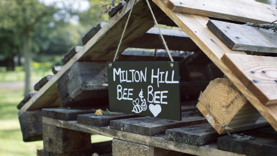
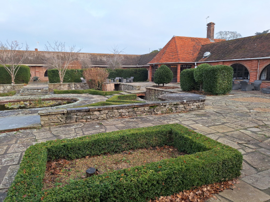
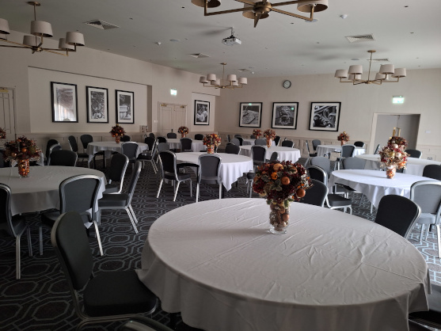
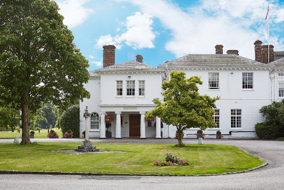



## Location

The retreat will be hosted at [Milton Hill House][MiltonHillHouse], which is surrounded by 22 acres of landscaped grounds and trees, delivering tranquil setting and backdrop for SoCraTes UK {{ site.event_details.year }}.

[Milton Hill House][MiltonHillHouse] is just 40 minutes by train into London’s Paddington, 16 minutes drive from junction 13 of the M4, 25 minutes drive from Oxford, 60 miles from London Heathrow and 80 miles from Gatwick airport. [Milton Hill House][MiltonHillHouse] is easily accessible by rail, air, or car. It’s situated on the A4130 between Milton and Rowstock, within easy reach of London and the main motorways.

The nearest train station is Didcot Parkway, 4 miles away.

Please check [Milton Hill House Google Maps location][MiltonGoogleMaps] to ensure you get to the hotel correctly.

Free parking is available. There are not yet charging bays for electric vehicles on site but the nearest ones are a few hundred metres away, with a bigger charging station in Milton (TBC location).

	

		

			
		

		

			
		

	

	

		

			
		

		

			
		

	

### When can I check in?

Check ins will start on ***Thursday after TBCpm***. SoCraTes UK {{ site.event_details.year }} will start at TBCpm, just before dinner.

 

### When do I need to check out?

Check outs must be finished ***on Sunday before TBCam. Late check outs are TBC***.

 

### How to get there?

<iframe src="https://www.google.com/maps/embed?pb=!1m18!1m12!1m3!1d631797.7232249748!2d-1.9893201826891131!3d51.788619886494786!2m3!1f0!2f0!3f0!3m2!1i1024!2i768!4f13.1!3m3!1m2!1s0x4876b9eb9a21583d%3A0x8f588d495e266418!2sMilton%20Hill%20House!5e0!3m2!1sen!2suk!4v1705788861682!5m2!1sen!2suk" width="600" height="450" style="border:0;" allowfullscreen="" loading="lazy" referrerpolicy="no-referrer-when-downgrade"></iframe>

**Milton Hill House**  
Steventon,  
Abingdon,  
Oxford,  
OX13 6AF
England, United Kingdom 
T: +44 (0) 1235 831 474

The best place to find out how to get there is [Milton Hill House's site][MiltonHillHouse].

The nearest station is Didcot Parkway Station. It is 4 miles and 16 minutes’ drive away. There are local taxis available to get from Didcot station to the venue.

Please check our wiki for the [local taxi companies][].

Didcot Parkway rail station has links and connections from London Paddington station, Heathrow and Gatwick airport.

Heathrow Airport is about 1 hour drive from the venue and Gatwick Airport about 1h30.

__TAXIS:__ If using taxis, either use [Uber][] or one of the [local taxi companies][] listed on the wiki. They are much cheaper. Be aware that they normally ask you to wait for them at the departures "drop off" and you will need to make your way there from the arrivals. 

The fastest way to get to London from any airport is by train. Take a look at [National Rail][] for routes, times, prices and to book your tickets. If you are coming in a group, bear in mind you could save money. Three or four people travelling together pay for only two tickets if the service is off-peak (remember, you need to get these group tickets at the ticket office, rather than online or using the ticket machines at the train station).

You normally can get direct trains to Didcot Parkway from London Paddington station. The train fare should cost from £32 each way when bough in advance [GWR][] (2 singles seem cheaper than a return...). When buying your train ticket, go to the ticket office instead of buying on the machines and show your tube ticket as you may get more than 50% discount — they will charge you only for the stretch beyond the zones you already paid for when coming to central London from the airport. That's the same for people with Oyster cards.

If you prefer to get to London by coach, [National Express][National Express from airports] is probably the best option, with wi-fi on their coaches.

More details can be found on the airport websites:

- [London Heathrow Airport][]
- [London Gatwick Airport][]
- [London Stansted Airport][]
- [London Luton Airport][]
- [London City Airport][]
- [London Southend Airport][]
- [Birmingham Airport][]

Once in London you might need a [tube map][Tube Map]. For more info on transport in London visit [the Transport for London website][Transport for London].
